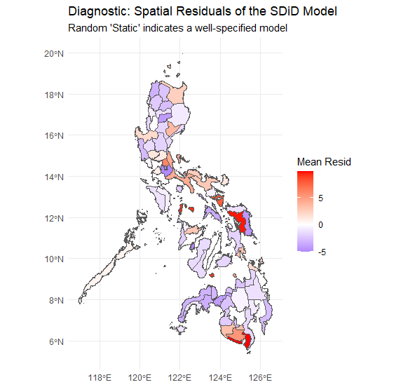

# Spatial-Impact-Analysis-of-Rice-Tariffication-Law-on-Philippine-Farmgate-Prices
Utilizes a Spatial Difference-in-Differences (SDiD) audit to evaluate the impact of the Rice Competitiveness Enhancement Fund (RCEF) on farmgate prices across 81 Philippine provinces.

📊 Executive Summary

This repository executes a Spatial Difference-in-Differences (SDiD) audit to evaluate the impact of the Rice Competitiveness Enhancement Fund (RCEF) on farmgate prices across 81 Philippine provinces. By accounting for spatial autocorrelation, the model isolates the true policy effect from regional market "contagion."

🧠 Key Econometric Findings

The Treatment Effect ($\beta$): -0.28 (p < 0.001) — Confirms a statistically significant revenue contraction for farmers in RCEF-priority provinces compared to control groups.

The Spatial Contagion ($\rho$): 0.87 — Reveals that 87% of price shocks are shared with neighboring provinces, proving that standard OLS models would yield biased results due to SUTVA violations.

The Global Moran's I (p < 0.0001): Provides the mathematical "permission slip" to use spatial modeling by proving pre-existing price clustering.

🛠️ The Workflow (Logical Audit Trail)

The Environment: Loaded splm for spatial panel modeling and spdep for weight matrix construction.

The ETL: Standardized PSA price datasets (2016-2025) and handled missing values through linear interpolation to maintain panel balance.

The Binary Transformation: Defined the Treated (RCEF-priority) and Post (Post-March 2019) variables.

The Logical Audit: Synchronized tabular data with a .json shapefile to ensure topological integrity for the Spatial Weights Matrix ($W$).

🗺️ Diagnostic Visualizations

1. Parallel Trends Validation
This plot confirms that before the 2019 intervention, the treatment and control provinces followed a similar price trajectory, satisfying the core assumption of DiD modeling.

3. Spatial Connectivity (W-Matrix)
This visualization illustrates the KNN-based spatial weights matrix used to control for geographic price contagion.

5. Residual Map (Model Accuracy)
The Spatial Residual Map confirms a well-specified model. The random distribution of residuals indicates that the spatial lag successfully captured localized shocks.

